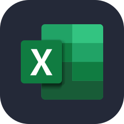

  

---

### 👨‍💻 About Me

- 🔭 Developed comprehensive **ERP, Logistics, and Data Analysis tools**
- 💡 Architecting scalable and business-critical software systems
- 🔗 Integrating complex third-party APIs to extend platform capabilities
- 💬 Always open to discussing **Full Stack Development & Data Analytics**
- 📫 Let's connect on **[LinkedIn](https://linkedin.com/in/celaldurmusoglu)**
- ⚡ Passionate about solving complex problems and turning raw data into actionable insights

---

### 🛠️ Tech Stack & Tools

**Programming Languages**

  
  
  
  
  
  
  
  
  
  
  

**Frameworks & Libraries**

  
  
  
  
  
  
  
  
  

**Databases**

  
  
  
  
  
  

**DevOps & Tools**

  
  
  
  
  
  
  
  
  
  
  
  

**Data & Analysis Tools**

  
  
  
  
  
  
  

**Softwares**

  
  
  
  
  
  

---

### 🤝 Connect with me

  

